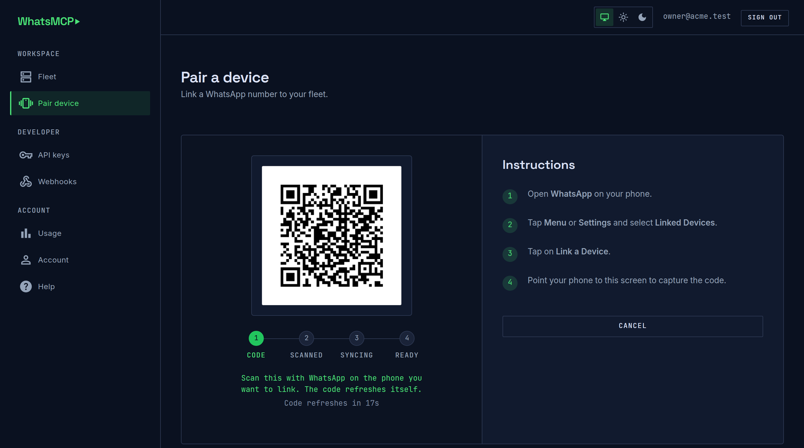

# WhatsMCP — WhatsApp for AI agents


**A hosted [Model Context Protocol](https://modelcontextprotocol.io) server that gives your
agent a real WhatsApp account.** Link your number once, point any MCP client at one HTTPS
endpoint, and your agent can read chats, reply, look people up in the address book, manage
groups, fetch attachments and receive inbound messages by webhook.

There is nothing to install and nothing to run locally — it is a **remote MCP server over
Streamable HTTP**. Your agent talks to `https://app.whatsmcp.com/mcp` with a bearer token.

> **Not the WhatsApp Business API.** No templates, no 24-hour session window, no message
> approval, no per-conversation billing. You link a normal WhatsApp account by scanning a
> QR code from the phone — exactly like WhatsApp Web — and your agent uses it as a linked
> device.

---

## Contents

- [Quick start](#quick-start)
- [Register](#register)
- [Link a WhatsApp number](#link-a-whatsapp-number)
- [Create an API key](#create-an-api-key)
- [Connect your client](#connect-your-client)
- [Tools](#tools)
- [Contacts](#contacts)
- [Reading incoming messages](#reading-incoming-messages)
- [Webhooks](#webhooks)
- [Sending](#sending)
- [Groups and channels](#groups-and-channels)
- [Refusals and error handling](#refusals-and-error-handling)
- [Security model](#security-model)
- [Links](#links)

---

## Quick start

```
1. Create a workspace     →  https://app.whatsmcp.com/console/register
2. Link a WhatsApp number →  Console → Pair device (scan the QR with your phone)
3. Mint an API key        →  Console → API keys (it is shown once — copy it)
4. Point your client at   →  https://app.whatsmcp.com/mcp
                             Authorization: Bearer <your key>
```

For Claude Code that last step is one command:

```sh
claude mcp add --transport http wamcp https://app.whatsmcp.com/mcp \
  --header "Authorization: Bearer YOUR_KEY"
```

Then ask your agent: *“list my WhatsApp accounts and show me the last few messages.”*

---

## Register

Sign-up is self-serve and free — no card, no sales call.

| | |
|---|---|
| **Create an account** | <https://app.whatsmcp.com/console/register> |
| **Sign in** | <https://app.whatsmcp.com/console/login> |
| **Product site** | <https://whatsmcp.com> |

You give a name and an email address. We send a confirmation link; opening it is where you
choose a password. Confirming creates your **workspace** (tenant) on the free plan and drops
you into a short setup wizard that walks the three steps that turn a bare account into a
working integration: **link a number**, **mint a key**, and — optionally — **point a
webhook** at your endpoint. It is derived from what you have actually done rather than a
checklist you tick, so it disappears once you are set up and comes back if you unlink
everything.

Everything lives in the console:

| Console page | What it is for |
|---|---|
| [Fleet](https://app.whatsmcp.com/console/fleet) | Every linked number and whether it is connected |
| [Pair device](https://app.whatsmcp.com/console/pair) | Link a new WhatsApp number by QR |
| [API keys](https://app.whatsmcp.com/console/keys) | Mint and revoke keys; copy-paste connection examples |
| [Webhooks](https://app.whatsmcp.com/console/webhooks) | Inbound delivery endpoint and its recent attempts |
| [Usage](https://app.whatsmcp.com/console/usage) | Messages sent against your plan's caps |
| [Help](https://app.whatsmcp.com/console/help) | The connection details for *your* workspace, and which tools your plan includes |

Per-number pages (Messages, **Contacts**, Calls) hang off each account in the same console.

---

## Link a WhatsApp number

WhatsMCP connects as a **linked device**, the same mechanism as WhatsApp Web. Your phone
stays the primary device and can stay in your pocket afterwards.

**From the console:** open [Pair device](https://app.whatsmcp.com/console/pair), then on the
handset go to **WhatsApp → Settings → Linked devices → Link a device** and scan the code.



The code rotates roughly every 20 seconds and the page refreshes itself, so a stale QR never
sits there failing to scan. The stepper underneath tracks the whole run: the handset accepts
the code (**scanned**), the device logs in and pulls its history (**syncing**), and only then
is the number **ready** to use.

**From the agent**, with the `wa_pair_account` tool:

```jsonc
// 1. start pairing — returns a QR as a base64 PNG for the user to scan
wa_pair_account()
→ { "pair_id": "…", "state": "qr", "qr_png_base64": "iVBORw0…", "instructions": "…" }

// 2. the code rotates about every 20 seconds — poll for the current one
wa_pair_status({ "pair_id": "…" })
→ { "state": "qr",     "qr_png_base64": "…" }     // show the new image
→ { "state": "paired", "instructions": "Linked. …" }  // done
```

Once `state` is `paired` the number appears in `wa_list_accounts` and is ready to use.
`wa_unpair_account` disconnects it again.

---

## Create an API key

[Console → API keys](https://app.whatsmcp.com/console/keys) → **Create key**.

Keys look like `wamcp_live_XXXXXXXXXXXX_…` and are **shown exactly once** — we store only a
hash, so a lost key is replaced, never recovered. Mint one key per client or per environment
and revoke individually.

The key *is* the workspace. Every tool is scoped to it: there is no tenant argument to pass
and no way for one workspace to reach another's messages.

---

## Connect your client

Any MCP client that speaks **Streamable HTTP** and can set a header will work. Two values:

| | |
|---|---|
| **Endpoint** | `https://app.whatsmcp.com/mcp` |
| **Header** | `Authorization: Bearer <your key>` |

### Claude Code

```sh
claude mcp add --transport http wamcp https://app.whatsmcp.com/mcp \
  --header "Authorization: Bearer YOUR_KEY"
```

`claude mcp list` should then show `wamcp` connected.

### Claude Desktop

Add the server to the `mcpServers` block of your configuration file:

```json
{
  "mcpServers": {
    "wamcp": {
      "type": "http",
      "url": "https://app.whatsmcp.com/mcp",
      "headers": {
        "Authorization": "Bearer YOUR_KEY"
      }
    }
  }
}
```

### Codex

Remote servers are configured in `~/.codex/config.toml` — `codex mcp add` covers stdio
servers only. Keep the key in the environment rather than in the file:

```toml
[mcp_servers.wamcp]
url = "https://app.whatsmcp.com/mcp"
bearer_token_env_var = "WHATSMCP_API_KEY"
```

```sh
export WHATSMCP_API_KEY=wamcp_live_…
```

Codex sends that as `Authorization: Bearer …`. If you would rather set the header yourself
— or need to add others — use `http_headers` for static values and `env_http_headers` to
pull them from the environment instead.

### Every other client

Clients differ in where they keep configuration, but they all need the same two values
above: the endpoint as a **remote HTTP** (not stdio) server, and the key as an
`Authorization` header. If a client only offers "a command to run", it does not support
remote servers — there is no local process to point it at.

### Check it by hand

```sh
curl -s https://app.whatsmcp.com/mcp \
  -H "Authorization: Bearer YOUR_KEY" \
  -H "Content-Type: application/json" \
  -H "Accept: application/json, text/event-stream" \
  -d '{"jsonrpc":"2.0","id":1,"method":"tools/list","params":{}}'
```

Two things catch people out when driving the endpoint directly:

- **The reply may be server-sent-event framed** — one `data: ` line per message.
- **A tool result is text that is itself JSON**, so it is parsed twice.

The endpoint is **stateless** (MCP 2026-07-28 removed protocol sessions), so it needs no
sticky routing and it is safe to call from anywhere. It also publishes RFC 9728
protected-resource metadata at
[`/.well-known/oauth-protected-resource`](https://app.whatsmcp.com/.well-known/oauth-protected-resource).

---

## Tools

26 tools. Which ones appear in `tools/list` depends on your plan — a tool your plan does not
include is **absent**, not present-and-refusing.

**Start with `wa_list_accounts`.** Every other tool takes an `account_id` from it, and an
account is usable only while its `state` is `connected`.

### Accounts and pairing

| Tool | Does |
|---|---|
| `wa_list_accounts` | Lists your linked numbers: `account_id`, `phone`, `push_name`, `state` (`pairing`, `connected`, `disconnected`, `logged_out`, `locked`) |
| `wa_pair_account` | Starts linking a new number; returns a QR as a base64 PNG |
| `wa_pair_status` | Polls a pairing; returns a fresh code while one is waiting |
| `wa_unpair_account` | Disconnects a linked number |

### Messaging

| Tool | Does |
|---|---|
| `wa_send_message` | Sends text, an image, a document or audio from one of your numbers |
| `wa_list_messages` | Reads messages across accounts, oldest first, paged by cursor |
| `wa_get_chat` | Recent messages for one account, no cursor — a one-off catch-up |
| `wa_get_media` | Downloads a received attachment by `message_id` (base64 + mime) |

### Contacts

| Tool | Does |
|---|---|
| `wa_list_contacts` | The account's address book, paged |
| `wa_search_contacts` | Finds contacts by name or number |

### Groups and channels

| Tool | Does |
|---|---|
| `wa_list_groups` | Groups an account has joined — JID, name, member count |
| `wa_list_channels` | Channels an account follows — JID, name, subscriber count |
| `wa_join_group` | Joins a group from an invite link |
| `wa_follow_channel` | Follows a Channel from its link |
| `wa_leave_chat` | Leaves a group or unfollows a channel |
| `wa_list_group_members` | A group's members, each with JID, phone and admin flag |
| `wa_create_group` | Creates a group; returns its JID and invite link |
| `wa_add_participants` / `wa_remove_participants` | Adds or removes members |
| `wa_promote_participants` / `wa_demote_participants` | Grants or revokes admin |
| `wa_delete_group` | Removes every other member, then leaves (WhatsApp has no true delete) |

### Calls

| Tool | Does |
|---|---|
| `wa_list_calls` | Call history, oldest first, paged — direction, peer, `answered`, `seconds`, `reason`, `codec` |

### Webhooks *(paid plans)*

| Tool | Does |
|---|---|
| `wa_set_webhook` | Registers an HTTPS endpoint for inbound messages |
| `wa_get_webhook` | Shows the endpoint, whether it is enabled, when it last succeeded |
| `wa_delete_webhook` | Stops delivery; messages remain readable through the tools |

---

## Contacts

Your agent should not have to make you be the address book. Two tools read the contacts
**synced from the phone the account is linked to**, so an agent can turn *“message Alice”*
into a number on its own.

Both read the account's **local** contact store. Nothing here talks to WhatsApp: no lookups
are performed against the network, and asking is free of any rate cost beyond your plan's
ordinary request throttling.

### `wa_list_contacts` — the whole address book

```jsonc
wa_list_contacts({ "account_id": "acct_…", "limit": 500 })
→ {
    "contacts": [
      { "phone": "447700900111", "name": "Alice Perreira", "name_source": "saved",
        "jid": "447700900111@s.whatsapp.net" },
      { "phone": "447700900222", "name": "Bakery",         "name_source": "business", "jid": "…" },
      { "phone": "447700900333", "name": "dave",           "name_source": "push",     "jid": "…" }
    ],
    "total": 482,
    "next_cursor": "447700900333",
    "has_more": true
  }
```

| Field | Meaning |
|---|---|
| `phone` | International form, digits only — pass this straight to `wa_send_message`. Empty for a LID-form contact whose number this account has never been told |
| `name` | The best available display name |
| `name_source` | **`saved`** — what the account owner wrote in their own address book · **`business`** — a verified business name · **`push`** — what the contact calls *themselves*, vouched for by nobody |
| `jid` | WhatsApp's own identifier |
| `total` | How many contacts matched **before** the page limit, so a model can tell a page from the whole book |
| `next_cursor` / `has_more` | Page until `has_more` is false to read everything |

Paging is by cursor over a stable order (sorted by phone), so it never repeats or skips a
row. Default page 500, maximum 2000.

### `wa_search_contacts` — find one person

```jsonc
wa_search_contacts({ "account_id": "acct_…", "query": "+44 7700 900111" })
```

Matching is case-insensitive and ignores punctuation in numbers, so `"+44 7700 900111"`
finds a contact stored as `447700900111`. It looks at saved names, business names, the name
the contact publishes for themselves, and the number. An empty result means no match — not
an error.

### Things worth knowing

- **A newly linked account starts with an empty address book.** Contacts arrive from the
  phone by app-state sync shortly after linking, so "no contacts" right after pairing is
  usually "not synced yet". The tool says so in a `note` rather than letting an agent report
  that a customer with 500 contacts has none.
- **Only numbers saved on the phone itself** are contacts. Someone you have chatted with but
  never saved has no address-book entry — but they do appear as a `peer` in
  `wa_list_messages`.
- **If the account is offline**, the read refuses with `account_not_connected` and a
  retry-after, rather than returning an empty book that reads as "you know nobody".
- The console shows the same address book per number under **Contacts**, if you would rather
  look with your eyes.

---

## Reading incoming messages

**The server never pushes to your agent.** Nothing can interrupt a model when a message
arrives, so your agent reads on its own schedule — and a **cursor** is what makes that
reliable.

`wa_list_messages` returns messages oldest-first, each with a `cursor`, plus a `next_cursor`
for the page and `has_more`. Pass a cursor back as `after_cursor` to get **only what has
arrived since** — no gaps, no duplicates, even for two messages in the same millisecond,
which a timestamp cannot promise.

```
after = 0
repeat:
    r = wa_list_messages(after_cursor = after)
    for m in r.messages:
        if m.direction == "inbound":
            handle(m)                 # e.g. reply with wa_send_message
    after = r.next_cursor             # advance — only newer rows next time
    if not r.has_more:
        sleep(a while)                # caught up; poll again later
```

Each row says who and where:

| Field | Meaning |
|---|---|
| `direction` | `inbound` (received) or `outbound` (sent by you) |
| `peer` | The other party's number. **In a group or channel this is the individual sender**, not the conversation |
| `chat` | The conversation JID — `…@g.us` for a group, `…@newsletter` for a channel |
| `chat_kind` | `dm`, `group`, `channel` or `broadcast` |
| `kind` / `text` | The content kind and the body (only text carries a body — fetch the rest with `wa_get_media`) |
| `at`, `message_id` | RFC3339 timestamp, and WhatsApp's id |

To reply: in a **DM** send `to` the peer's number; in a **group or channel** send `to` the
`chat` JID — sending to the individual peer would start a private chat instead.

> **In Claude Code**, the `/loop` command automates exactly this: it polls on a cadence, acts
> when the message appears, and stops. See running loops with `/tasks`.

For a one-off catch-up on a single account rather than a poll, `wa_get_chat` returns recent
messages without a cursor.

---

## Webhooks

If you would rather not poll, `wa_set_webhook` delivers each inbound message to an HTTPS
endpoint as it arrives *(paid plans)*.

```json
{
  "event": "message.inbound",
  "delivery_id": "01JB…",
  "tenant_id": "01JA…",
  "account_id": "01J9…",
  "account_phone": "447700900000",
  "message_seq": 48210,
  "message_id": "3EB0…",
  "chat_jid": "447700900111@s.whatsapp.net",
  "peer": "447700900111",
  "kind": "text",
  "body": "are you open on Sunday?",
  "at": "2026-09-02T14:21:07Z"
}
```

`account_phone` is **your own** number that received the message — what a routing rule, a CRM
or a support queue is usually keyed on. `message_seq` is the same cursor `wa_list_messages`
uses, so a consumer that missed a delivery can reconcile instead of guessing.

Each request carries:

| Header | Value |
|---|---|
| `X-WAMCP-Signature` | `t=<unix>,v1=<hex hmac-sha256>` |
| `X-WAMCP-Delivery` | The delivery id, for idempotency |
| `X-WAMCP-Event` | The event name, so you can route without parsing the body |

**Verify the signature** — recompute `HMAC-SHA256(secret, "<unix>" + "." + <raw body>)` and
compare in constant time, rejecting a stale timestamp:

```python
import hashlib, hmac, time

def verify(secret: str, header: str, body: bytes, tolerance: int = 300) -> bool:
    parts = dict(p.split("=", 1) for p in header.split(","))
    ts, sig = parts["t"], parts["v1"]
    if abs(time.time() - int(ts)) > tolerance:
        return False
    mac = hmac.new(secret.encode(), f"{ts}.".encode() + body, hashlib.sha256)
    return hmac.compare_digest(mac.hexdigest(), sig)
```

Answer `2xx` to acknowledge. One attempt is bounded at 10 seconds; a failure is retried with
exponential backoff up to 8 attempts, and answering `410 Gone` stops delivery of that message
permanently — it is the endpoint saying it is never coming back. Recent attempts and their
outcomes are visible in [Console → Webhooks](https://app.whatsmcp.com/console/webhooks).

---

## Sending

```jsonc
wa_send_message({
  "account_id": "acct_…",
  "to": "447700900111",          // international form, digits only — or a …@g.us / …@newsletter JID
  "text": "on my way"
})
→ { "status": "sent", "message_id": "3EB0…", "request_id": "01JB…" }
```

Attachments ride the same tool. `text` becomes the caption where one applies:

| Argument | Limit | Notes |
|---|---|---|
| `image_base64` + `image_mime` | 5 MiB decoded | JPEG or PNG |
| `document_base64` + `document_mime` + `document_filename` | 20 MiB decoded | Any file; the filename is what the recipient sees |
| `audio_base64` + `audio_mime` (+ `audio_seconds`, `audio_ptt`) | 16 MiB decoded | `audio_ptt: true` sends a voice note. Audio has no caption |

**Check the returned `status`. The three values mean different things:**

| `status` | Meaning |
|---|---|
| `sent` | Delivered to WhatsApp; `message_id` is set |
| `queued` | Accepted but **not yet confirmed**. It may still arrive — **do not send it again.** Reconcile it later in `wa_list_messages` by its `request_id` |
| `refused` | Nothing was sent; `refusal.reason` says whether retrying helps |

An agent that treats `queued` as failure will send your customer the same message twice.

---

## Groups and channels

Listing groups and channels is part of the read surface. **Joining, leaving, messaging and
group management require the account to be opted into group and channel messaging on its
bridge** — ask us to switch it on for a number. Without it the account refuses these calls,
and the refusal says so verbatim rather than failing generically.

Group management (`wa_create_group`, add/remove, promote/demote, delete) follows WhatsApp's
own rules: mutations that need admin fail without it. `wa_delete_group` removes every other
member and then leaves, because WhatsApp has no true delete.

---

## Refusals and error handling

A tool that declines does **not** raise a protocol error — it returns a structured refusal,
so a model can read it and decide what to do:

```json
{
  "refused": true,
  "reason": "account_not_connected",
  "message": "this account's bridge is not currently connected, so its contacts cannot be read; it reconnects on its own",
  "retry_after_seconds": 30
}
```

| `reason` | Meaning |
|---|---|
| `invalid_request` | Bad or missing arguments, or an id that does not exist in your workspace |
| `account_not_connected` | The number is offline. It reconnects on its own — retry |
| `account_locked` | WhatsApp has locked this account; `message` carries the reason |
| `quota_exceeded` | Your plan's send cap for the window |
| `plan_required` | The capability is on a higher plan |
| `throttled` | Too many requests, or the account did not answer in time — retry |

`retry_after_seconds` absent or `0` means **retrying will not help**.

At the transport level: an invalid or revoked key gets `401` (never `500`, so a client does
not retry a dead credential forever), and the endpoint is rate-limited per source address.

---

## Security model

- **The key is the identity.** It is verified at the edge and resolved to a workspace before
  any tool runs; the workspace travels on the request context, never as a tool argument.
  There is no field in which one workspace could name another.
- **A foreign id reads as "no such account"**, not "forbidden" — probing reveals nothing.
- **Keys are stored hashed**, shown once at creation, and revocable individually.
- **Webhook bodies are signed** with HMAC-SHA256 over a timestamped payload.
- Your WhatsApp account remains yours: WhatsMCP is a linked device, and you can remove it at
  any time from the handset (**Settings → Linked devices**) or with `wa_unpair_account`.

---

## Links

| | |
|---|---|
| Product site | <https://whatsmcp.com> |
| Create an account | <https://app.whatsmcp.com/console/register> |
| Sign in | <https://app.whatsmcp.com/console/login> |
| Console | <https://app.whatsmcp.com/console> |
| Help (your workspace's own connection details) | <https://app.whatsmcp.com/console/help> |
| MCP endpoint | `https://app.whatsmcp.com/mcp` |
| Model Context Protocol | <https://modelcontextprotocol.io> |
| Privacy Policy | <https://whatsmcp.com/privacy> |
| Terms of Service | <https://whatsmcp.com/terms> |
| Contact / support | <https://whatsmcp.com/contact> |

Questions, a number that needs group messaging switched on, or a plan that does not fit —
open an issue here, use the contact link above, or write to us from the console.
